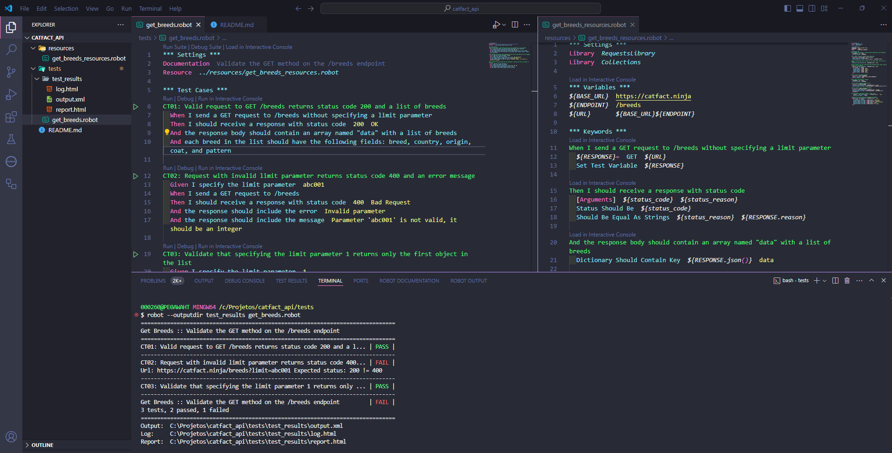
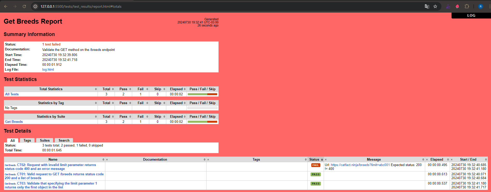

<h1 align="center">🧙‍♂️ Cat Facts API Automation with Robot Framework</h1>

 
    
    

## ✨ Technologies

This project was developed using the following technologies:

- [Robot Framework 6.1.1](https://robotframework.org/)
- [Python 3.7.4](https://www.python.org/)

## 💻 Project

This project is designed to perform GET method tests on the endpoint `https://catfact.ninja/breeds`. The following test cases have been automated:

- **CT01**: Valid request to GET `/breeds` returns status code 200 and a list of breeds.
- **CT02**: Request with invalid limit parameter returns status code 400 and an error message.
- **CT03**: Validate that specifying the limit parameter `1` returns only the first object in the list.

## 🚀 How to Run

1. Clone the this repository.

2. Install [Python 3.7.4](https://www.python.org/downloads/release/python-374/).

3. Install Robot Framework by running the following command in your terminal:

    `pip install robotframework==6.1.1`

4. Install the lib RequestsLibrary: 
This library is used in the tests. You can install it via pip by running the following command in your terminal:

    `pip install robotframework-requests`

    *Tip*: Collections Library: This is a standard library in Robot Framework, so no additional installation is required.

5. Navigate to the project directory and then to the /tests folder. Run the tests using the following command in your terminal:

    `$ robot --outputdir test_results get_breeds.robot`

    *Tip*: The `--outputdir test_results` option will place the generated files by Robot Framework into the tests/test_results directory.

## 📄 Test Results

After running the tests, you will find the following files in the test_results directory:

- log.html: Detailed log of the test execution.
- report.html: Summary report of the test results.
- output.xml: Machine-readable test results.

Feel free to review these files to analyze the test outcomes.

## 📱 Contact

For more information, please contact me via my [LinkedIn](https://www.linkedin.com/in/rafaelrabelodasilva/)